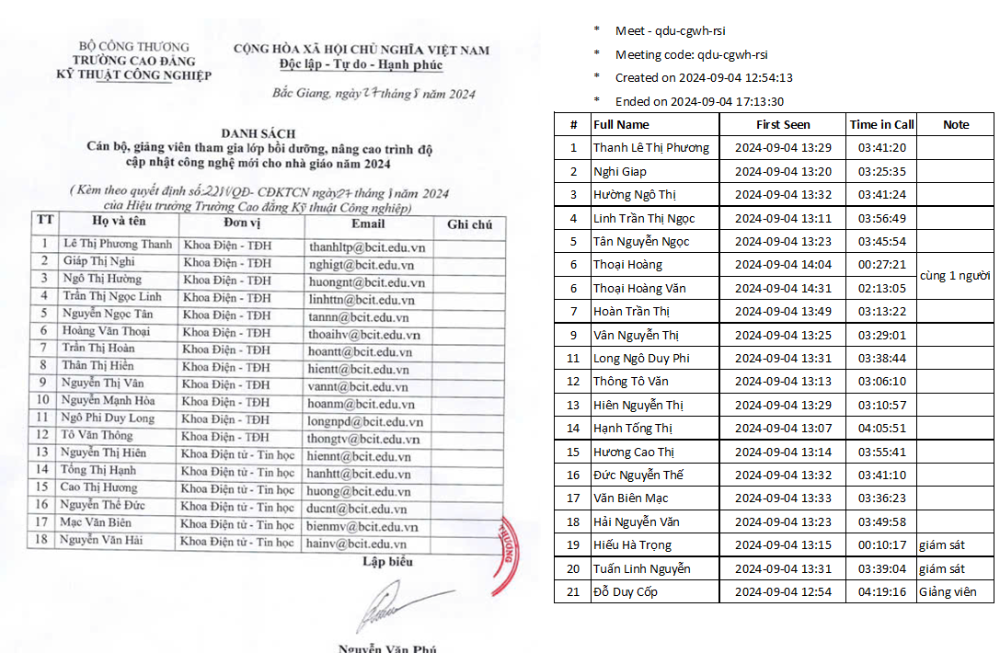

# Buổi học 1

Thời gian: 13h30 ngày 04/09/2024

Hình thức: [online meet](https://meet.google.com/qdu-cgwh-rsi)

## Tài liệu:

1. Bộ cài đặt phần mềm lập trình Arduino: [Arduino IDE 2.3.2](https://www.arduino.cc/en/software)
2. Tài liệu về phần cứng Arduino [Hardware Docs](https://docs.arduino.cc/hardware/)
3. Tài liệu về phần mềm Arduino [Software Docs](https://docs.arduino.cc/software/ide/)
4. Tài liệu tra cứu cho lập trình Arduino: [Arduino Programming](https://docs.arduino.cc/programming)
5. Phần mềm vẽ mạch và chạy mô phỏng: [Proteus 7.8](https://drive.google.com/file/d/1RC12hwjVEnWNopd_tyWFzn0z3XM9Vc0x/view?usp=sharing)
6. Code blink nhấp nháy đèn led buildin trên esp8266 : [blink.ino](day1/blink.ino)
7. Code đọc độ ẩm và nhiệt độ của cảm biến DHT11 trên esp8266 : [read sensor DHT11](day1/doc_cam_bien_DHT11.ino)
8. Phần mềm Dev Cpp để lập trình C : [Dev-Cpp 5.11](https://sourceforge.net/projects/orwelldevcpp/files/Portable%20Releases/Dev-Cpp%205.11%20TDM-GCC%20x64%204.9.2%20Portable.7z/download)
9. Nhật ký học ngôn ngữ C - để dùng cho lập trình Arduino [Nhật ký học C - buổi 1](day1/log_day1.pdf)
10. Code cpp buổi học số 1: [vd1](day1/vd1.cpp),  [vd2](day1/vd2.cpp),  [vd3](day1/vd3.cpp),  [vd4](day1/vd4.cpp),  [gptb2](day1/gptb2.cpp)

## Thành viên tham gia buổi học: 
  
  
  

