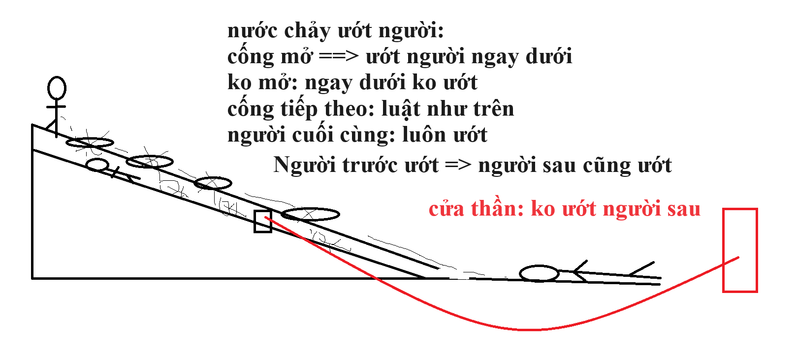

# BUỔI HỌC 3

THỜI GIAN: 06/09/2024

HÌNH THỨC: [ONLINE MEET](https://meet.google.com/qov-btdk-dst)

## Log thành viên tham gia: ## [log join meet](day3/meeting_9-6-2024_12-47-16 PM_qov-btdk-dst.csv)

## Nội dung

### Ngôn ngữ lập trình C

1. Cài đặt môi trường

  - Cài đặt Dev Cpp:

    + download

    + giải nén

    + chạy file: **devcpp.exe**
   
  - Sử dụng Dev Cpp
    + Bước 1: Tạo file code mới hoặc Mở file code cũ.
    + Bước 2: nhập/sửa code, hoàn thiện code theo thuật toán.
    + Bước 3: Biên dịch file code. **Phím nóng: F9**
    + Bước 4: Đọc hiểu thông báo lỗi cú pháp (nếu có).
    + Bước 5: Sửa lỗi cú pháp (nếu có), sửa xong về **bước 3**
    + Bước 6: Chạy thử. **Phím nóng: F10**
    + Bước 7: Nhập dữ liệu để test logic.
    + Bước 8: Nếu logic sai, về **bước 2** để sửa code.
2. Cấu trúc chương trình C
  - Khai báo thư viện (nếu cần thư viện) : #include<tên thư viện>
  - Khai báo biến toàn cục, hằng toàn cục (nếu thuật toán cần)
    + KDL Tenbien;  //KDL là kiểu dữ liệu ở phần 3 nêu chi tiết
    + KDL b1,b2,b2;  //3 biến cùng kiểu liệu;
    + KDL bien=giatri; //khai báo có khởi tạo
  - Khai báo các hàm hỗ trợ (nếu cần):
  - Khai báo hàm main (bắt buộc): gọi các hàm hỗ trợ, thực hiện phép toán theo thuật toán....
3. Các kiểu dữ liệu:
  - Kiểu số nguyên: **char, int, long**
  - Kiểu số nguyên không dấu: thêm tiền tố **unsigned** kết hợp với 1 từ: **char, int, long**
  - Kiểu số thực: **float, double**
  - Kiểu logic : **bool**
  - Kiểu kí tự : **char**   vì khi printf("%c", x) với x là kiểu char thì printf sẽ in ra kí tự có mã ascii trong x
  - Kiểu mảng : KDL tên_mảng[số lượng phần tử]  // trong đó KDL là các kiểu ở trên, chi tiết mảng: học buổi 2
  - Kiểu chuỗi : char tên_mảng[số lượng phần tử]  // chuỗi thực ra là mảng các kí tự (char), có khởi tạo nhanh "nội dung"
4. Quy tắc đặt tên biến, tên hằng, tên hàm
  - **Từ khoá**:
    + dành riêng cho C, luôn có ý nghĩa xác định trước.
    + các từ là tên kiểu dữ liệu là từ khoá
    + void, if, for, while, do, switch, case, const ...      
  - Quy tắc đặt tên biến, tên hằng, tên hàm:
    + Tên **không** được trùng với từ khoá
    + Tên phân biệt chữ HOA và thường: A và a là 2 tên khác nhau
    + Tên phải bằng đầu bằng kí tự hoặc _, ko đc chứa kí tự đặc biệt
    + Tên không được chứa dấu cách (space)
5. Các toán tử:
  - Toán tử toán học cộng trừ nhân chia: +, -, *, /, % (% là chia lấy dư);  a/b => kq nguyên nếu a,b cùng là nguyên
  - Toán tử so sánh: >, <, <=, >=, ==, !=
  - Toán tử kết hợp: && (và), || (hoặc), ! (phủ định)
  - toán tử dấu ngoặc tròn: vd: if((a>b)||(a>c)){...}
  - Toán tử bít, làm việc theo cặp bít: & (AND theo cặp bít), | (OR theo cặp bít), ^ (XOR theo cặp bít)
6. Các cấu trúc điều khiển

6.1. Cấu trúc rẽ nhánh: //tới ngã 3 đi đâu? Sang quán bia hay về nhà ? có 2 lựa chọn
  - if(dk){khối lệnh}  : THỰC HIỆN KHỐI LỆNH OR KHÔNG THỰC HIỆN KHỐI ĐÓ TUỲ THEO ĐK CỦA IF ĐÚNG HAY SAI
  - if(dk){khối lệnh1} else{khối lệnh2} : 
    + nếu đk đúng thì chỉ có KL1 đc thực hiện, KL2 ko đc thực hiện; 
    + ngược lại (đk sai) thì KL1 ko đc thực hiện, chỉ có KL2 được thực hiện
  - if else có lồng nhau nhiều cấp: tuỳ thuộc thuật toán. lưu ý: dùng dấu { } hết sức cẩn thận
6.2. Cấu trúc rẽ nhiều nhánh:
  - Cấu trúc switch ... case

	nhớ hình 1 bé đứng te`, 
 	các cháu khác núp dưới cống, 
	cháu nằm dưới đường dưới cùng: 
	nắp cổng mở ~ t==case: cháu ngay dưới bị ướt,
	khi 1 nắp mở nước chỉ đi dưới cống

6.3. Cấu trúc lặp:
  - **for**:
    
  cú pháp
  
    for(khối1; khối2; khối3){thân_for}
    + khối 1: là khối khởi tạo vì nó chỉ đc chạy 1 lần duy nhất.
    + khối 2: khối điều kiện, trả về đúng hoặc sai, 
  - while
  - do ... while
